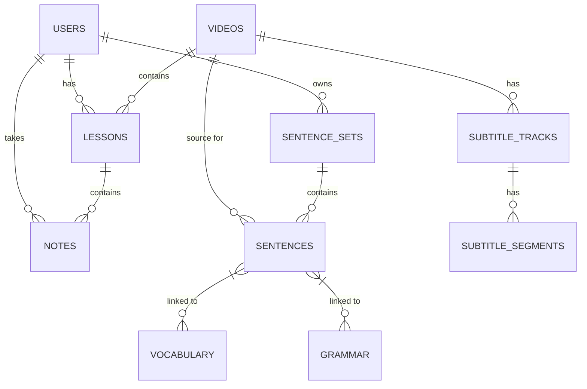

# PodLearn Database Schema

PodLearn uses a relational database structure (typically SQLite for development, PostgreSQL in production) to manage users, video content, and individual learning progress.

## Entity Relationship Diagram

## Core Tables

### 1. `users`
- **`id`**: Primary Key (Integer)
- **`username`**: String (80), Unique
- **`email`**: String (120), Unique
- **`password_hash`**: String (256)
- **`is_admin`**: Boolean (Default: False)
- **`current_streak`**: Integer (Gamification)
- **`longest_streak`**: Integer (Gamification)

### 2. `videos`
- **`id`**: Primary Key (Integer)
- **`youtube_id`**: String (20), Unique
- **`title`**: String (500)
- **`duration_seconds`**: Integer
- **`status`**: String (pending, processing, completed, failed)

### 3. `lessons`
*Links a user to a specific video and tracks their settings/progress.*
- **`id`**: Primary Key (Integer)
- **`user_id`**: Foreign Key (`users.id`)
- **`video_id`**: Foreign Key (`videos.id`)
- **`original_lang_code`**: String (10)
- **`target_lang_code`**: String (10)
- **`is_completed`**: Boolean
- **`time_spent`**: Integer (Seconds)
- **`settings_json`**: Text (UI customizations)

### 4. `sentences` & `sentence_sets`
*Used for the 'Mastery' features where users save specific patterns.*
- **`sentence_sets`**: Groups of sentences (id, user_id, title, set_type).
- **`sentences`**: Individual study records (id, user_id, set_id, original_text, translated_text, audio_url, detailed_analysis).

### 5. `notes`
- **`id`**: Primary Key (Integer)
- **`user_id`**: Foreign Key (`users.id`)
- **`lesson_id`**: Foreign Key (`lessons.id`)
- **`timestamp`**: Float (Time in video)
- **`vibe_level`**: Integer (Importance/Level)
- **`content`**: Text

### 6. Supporting Entities
- **`subtitles`**: Storage for raw and translated transcript data.
- **`grammar`**: Detailed grammar point definitions for mastery.
- **`vocabulary`**: Detailed vocabulary word definitions.
- **`settings`**: User-wide configuration flags and preferences.
