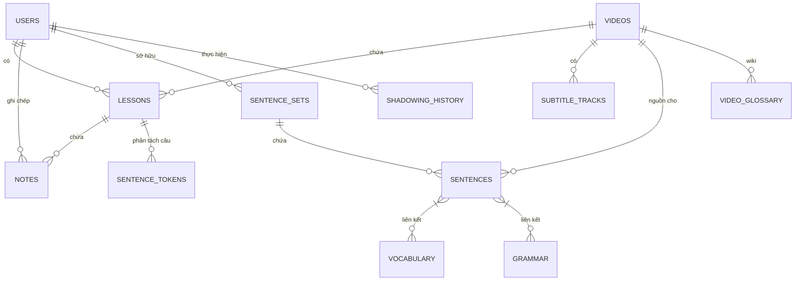

# Sơ đồ Cơ sở Dữ liệu PodLearn

PodLearn sử dụng cấu trúc cơ sở dữ liệu quan hệ (SQLite cho môi trường phát triển, PostgreSQL cho production) để quản lý người dùng, nội dung video, và tiến trình học tập cá nhân hóa.

## 📊 Sơ đồ Quan hệ Thực thể (ERD)

## 📋 Các Bảng Chính

### 1. `users` (Người dùng)
- **`id`**: Khóa chính (Integer).
- **`username`**: Tên đăng nhập (Unique).
- **`email`**: Email liên lạc (Unique).
- **`central_auth_id`**: UUID từ hệ thống CentralAuth (Đồng bộ SSO).
- **`current_streak` / `longest_streak`**: Dữ liệu Gamification.
- **`last_study_date`**: Ngày học cuối cùng để tính Streak.

### 2. `videos` (Video)
- **`youtube_id`**: ID duy nhất từ YouTube (vd: `dQw4w9WgXcQ`).
- **`title`**: Tiêu đề video.
- **`status`**: Trạng thái xử lý (pending, processing, completed, failed).
- **`visibility`**: Chế độ hiển thị (public, private).

### 3. `lessons` (Bài học)
*Liên kết người dùng với một video cụ thể để theo dõi tiến độ.*
- **`user_id`** / **`video_id`**: Khóa ngoại.
- **`time_spent`**: Tổng thời gian đã học (giây).
- **`is_completed`**: Đánh dấu hoàn thành bài học.
- **`last_accessed`**: Lần cuối cùng mở bài học.

### 4. `sentences` & `sentence_sets` (Bộ câu & Mastery)
- **`sentence_sets`**: Các "bộ sưu tập" câu (Mastery Decks) của người dùng.
- **`sentences`**: Các câu học tập cụ thể, lưu trữ văn bản gốc, dịch, âm thanh (audio_url) và phân tích ngôn ngữ sâu (JSON).

### 5. `shadowing_history` (Lịch sử Luyện nói)
- **`accuracy_score`**: Điểm độ chính xác (0-100).
- **`spoken_text`**: Văn bản người dùng đã nói (từ speech-to-text).
- **`start_time` / `end_time`**: Tọa độ thời gian trong video.

### 6. `video_glossary` (Wiki Từ vựng)
- **`term`**: Từ vựng/Thuật ngữ.
- **`definition`**: Định nghĩa cộng đồng.
- **`last_updated_by`**: Người dùng cập nhật cuối cùng.

### 7. Các bảng hỗ trợ khác
- **`subtitles`**: Lưu trữ nội dung phụ đề (JSON).
- **`notes`**: Ghi chú theo dòng thời gian trong player.
- **`sentence_tokens`**: Lưu trữ cách phân tách từ (segmentation) tùy chỉnh của người dùng cho từng dòng.
- **`share_requests`**: Quản lý việc chia sẻ workspace giữa các người dùng.

### 8. AI Insights (Phân tích Chuyên sâu)
- **`ai_insight_tracks`**: Theo dõi trạng thái phân tích cho toàn bộ video.
    - **`video_id`**: Khóa ngoại liên kết bảng `videos`.
    - **`status`**: Trạng thái (pending, processing, completed).
    - **`language_code`**: Ngôn ngữ mục tiêu của phân tích.
- **`ai_insight_items`**: Lưu trữ nội dung phân tích chi tiết cho từng câu (line).
    - **`track_id`**: Liên kết với `ai_insight_tracks`.
    - **`subtitle_index`**: Chỉ mục của dòng phụ đề trong video.
    - **`short_explanation`**, **`grammar_analysis`**, **`nuance_style`**, **`context_notes`**: Các cột dữ liệu phân tích cố định.
    - **`data_json`**: Chứa các thẻ kiến thức mở rộng (Vocabulary, Similar Sentences, Culture, Mnemonic, v.v.) dưới dạng JSON.
