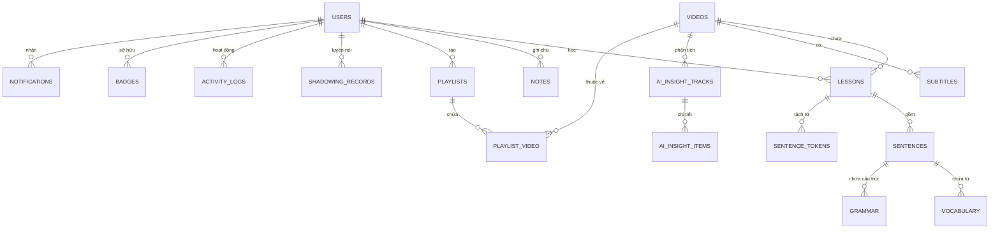

# Sơ đồ Cơ sở Dữ liệu PodLearn

PodLearn sử dụng cấu trúc cơ sở dữ liệu quan hệ (SQLite cho môi trường phát triển, PostgreSQL cho production) để quản lý người dùng, nội dung video, và tiến trình học tập cá nhân hóa.

## 📊 Sơ đồ Quan hệ Thực thể (ERD)

## 📋 Chi tiết các Bảng

### 1. Core Models (Lõi)
- **`users`**: Quản lý danh tính (CentralAuth ID), vai trò (admin/user), và dữ liệu Streak/Gamification.
- **`videos`**: Metadata từ YouTube, trạng thái xử lý media, và quyền riêng tư.
- **`lessons`**: Liên kết Người dùng - Video, theo dõi tiến độ hoàn thành và thời gian học.

### 2. Subtitles & Language (Phụ đề & Ngôn ngữ)
- **`subtitles`**: Lưu trữ các track phụ đề (S1: Gốc, S2/S3: Dịch) dưới dạng JSON hoặc văn bản.
- **`sentences`**: Các câu mẫu quan trọng được người dùng lưu lại để ôn tập SRS.
- **`sentence_tokens`**: Dữ liệu phân tách từ (segmentation) tùy chỉnh cho từng câu.
- **`vocabulary` / `grammar`**: Kho lưu trữ các mục từ vựng và điểm ngữ pháp đã học.
- **`glossaries`**: Wiki từ vựng cộng đồng cho từng video.

### 3. Study & Progress (Học tập & Tiến độ)
- **`notes`**: Ghi chú văn bản gắn liền với timestamp trong trình phát video.
- **`shadowing_records`**: Lưu trữ điểm số (accuracy), văn bản nhận diện (STT) và tệp ghi âm luyện nói.
- **`playlists`**: Danh sách phát video cá nhân (Sets).
- **`shares`**: Quản lý quyền truy cập bài học/video giữa các người dùng.

### 4. AI Insights (Phân tích Chuyên sâu)
- **`ai_insight_tracks`**: Quản lý trạng thái phân tích AI cho toàn bộ một Video.
- **`ai_insight_items`**: Kết quả phân tích 8 lớp cho từng dòng phụ đề (Dịch, Ngữ pháp, Văn hóa, Mẹo nhớ, v.v.).

### 5. Gamification & System (Hệ thống & Trò chơi hóa)
- **`badges`**: Các huy hiệu đạt được khi hoàn thành mục tiêu học tập.
- **`activity_logs`**: Nhật ký hoạt động chi tiết của người dùng.
- **`notifications`**: Thông báo hệ thống, lời mời chia sẻ.
- **`settings`**: Cấu hình cá nhân hóa (Giao diện, AI, TTS).
